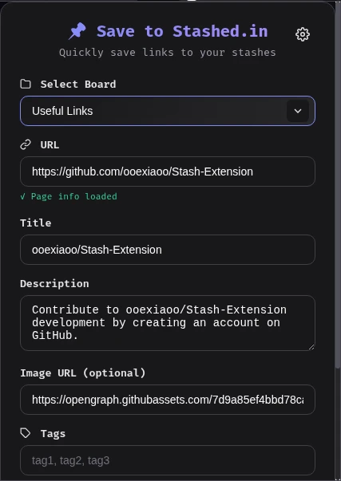
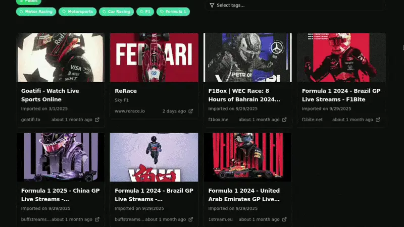

  <picture>
    <source media="(prefers-color-scheme: dark)" srcset="screenshots/logo.svg">
    
  </picture>

<h1 align="center">Stashed</h1>

<h3 align="center">Social Link Management Platform</h3>

  Save, organize, and access your links across all your devices.

  <a href="https://stashed.in">Web App</a> ·
  <a href="https://stashlist.pages.dev">Blog</a> ·
  <a href="https://github.com/ooexiaoo/stashed.in-releases/releases">Releases</a>

---

## Features

- **Save from anywhere** — browser extension for Chrome & Firefox to save links on the fly
- **Organize with collections** — group links into custom collections for easy retrieval
- **Cross-device sync** — access your saved links from any device, anytime
- **Android app** — native Android experience with the full Stashed feature set
- **Share collections** — share link collections with a single URL
- **Clean interface** — minimal, distraction-free design

## Downloads

| Platform | Download |
|----------|----------|
| Android | [Download APK](https://github.com/ooexiaoo/stashed.in-releases/releases) (latest release) |
| Browser Extension | [Chrome Web Store](https://chrome.google.com/webstore) · [Firefox Add-ons](https://addons.mozilla.org) |
| Web App | [stashed.in](https://stashed.in) |

## Screenshots

| Extension Preview | Hero Landing |
|:---:|:---:|
|  |  |

## Links

- **Web App**: [https://stashed.in](https://stashed.in)
- **Blog**: [https://stashlist.pages.dev](https://stashlist.pages.dev)
- **Twitter**: [@stashedin](https://twitter.com/stashedin)
- **Package Name**: `app.stashed.web`

## About

Stashed is a social link management platform that helps you save, organize, and share links across all your devices. Whether you're bookmarking articles, saving products, or building a collection of resources, Stashed keeps everything in sync and accessible.

Built with modern web technologies and available as a web app, browser extension, and native Android application.
